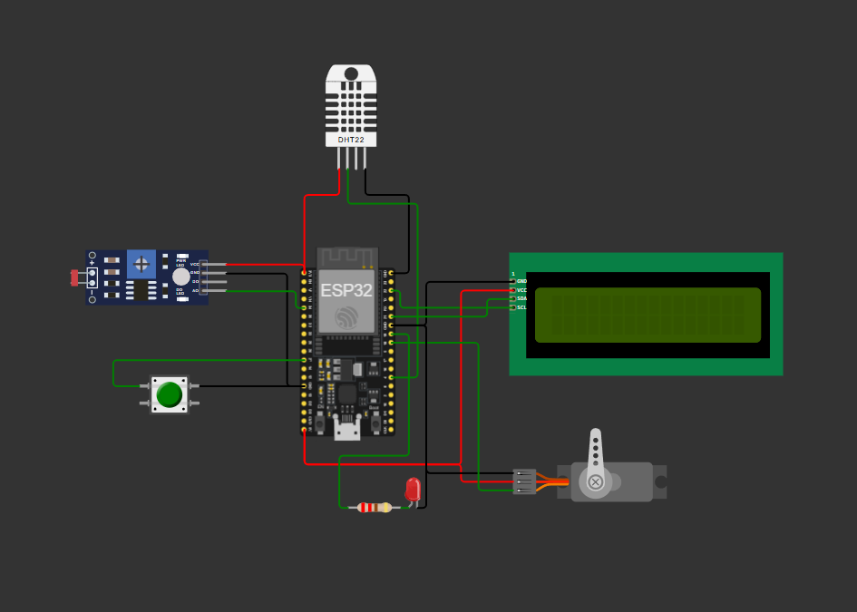

# Smart Room using ESP32

This is a mini project I built using ESP32 that automates a room's window and light based on temperature, humidity, and ambient light readings. There's also a manual mode you can switch to using a push button, and all the readings are shown live on a 16x2 LCD.

Simulated on Wokwi: https://wokwi.com/projects/467610020911860737

## What it does

- Reads temperature and humidity using a DHT22 sensor
- Reads ambient light using an LDR
- Opens/closes a window automatically (using a servo) based on room temperature
- Adjusts LED brightness automatically based on how bright/dark the room is
- Push button switches between AUTO and MANUAL mode
- Shows temperature, humidity, light value and current mode on the LCD
- Also prints all this data to the Serial Monitor

## How it works

In AUTO mode, the servo position depends on temperature:
- Below 25°C → window stays closed (0°)
- 25°C to 30°C → window half open (90°)
- Above 30°C → window fully open (180°)

The LED brightness is controlled using PWM, mapped from the LDR reading — brighter room means dimmer LED and vice versa.

Pressing the push button toggles between AUTO and MANUAL mode (handled using an interrupt with basic debounce).

## Components used

| Component | Purpose |
|---|---|
| ESP32 Dev Board | Main controller |
| DHT22 | Temperature & humidity sensor |
| LDR | Light sensor |
| SG90 Servo | Window control |
| LED | Room light (simulated) |
| Push Button | AUTO/MANUAL toggle |
| 16x2 I2C LCD | Status display |

## Pin connections

| Component | ESP32 Pin |
|---|---|
| DHT22 Data | GPIO 4 |
| LDR | GPIO 34 |
| Servo Signal | GPIO 18 |
| LED | GPIO 19 |
| Push Button | GPIO 27 |
| LCD | SDA/SCL (I2C) |

## Libraries used

- Wire.h (built-in)
- LiquidCrystal_I2C
- DHT sensor library (Adafruit)
- ESP32Servo

## Circuit Diagram



## How to run

**Option 1 — Wokwi (no hardware needed)**
Just open the project link above and hit simulate.

**Option 2 — On actual hardware**
1. Clone this repo:
   ```
   git clone https://github.com/pawan-tikar/Smart-Room.git
   ```
2. Open `sketch.ino` in Arduino IDE
3. Install the libraries listed above
4. Select Board = ESP32 Dev Module, and your COM port
5. Wire everything as per the pin table
6. Upload the code, open Serial Monitor at 115200 baud

## Possible improvements

- Adding WiFi so it can be controlled/monitored remotely
- Adding a motion or door sensor
- Logging sensor data somewhere (like ThingSpeak)

## Author

Pawan Tikar
B.Tech 3rd Year, Electronics Engineering
Yeshwantrao Chavhan College of Engineering, Nagpur
